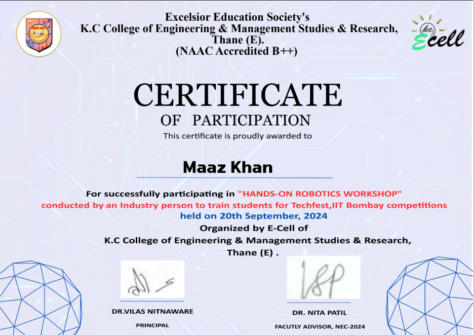

# 🎉 Certificate Automation and Sender 📧

Automates the generation of personalized certificates and emails them to recipients. Ideal for event organizers and educators.

## 🚀 Features
- Generate certificates with personalized names.
- Automatically email certificates.
- Delete certificates after sending.

## 🎓 Certificate Example

Here is an example of the generated certificate:



## 🛠️ Prerequisites
- Python 3.8 or higher.
- SMTP email account (e.g., Gmail).
- Install dependencies:
  ```bash
  pip install -r requirements.txt
